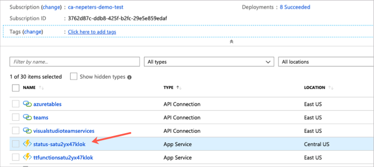
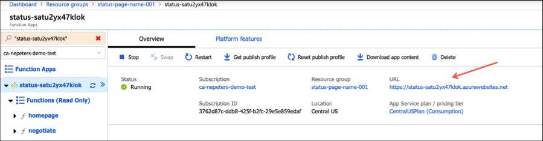

# OPS Learning Path Template (dev)

Templates will be used for OPS10 - OPS40.

## Browse to the Tailwind website

## Trigger the OPS20 incident logic app

## Browse to the OPS20 Status Page

Find the App Service with a name like `status-` and then a random string.

The Tailwind status page can be reached at the App Service URL.

## Create the OPS40 CI/CD Pipeline